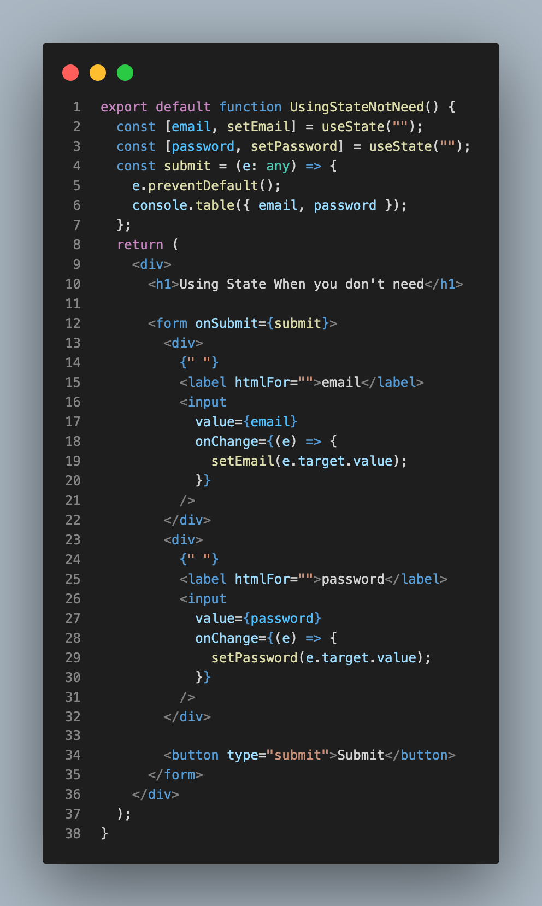
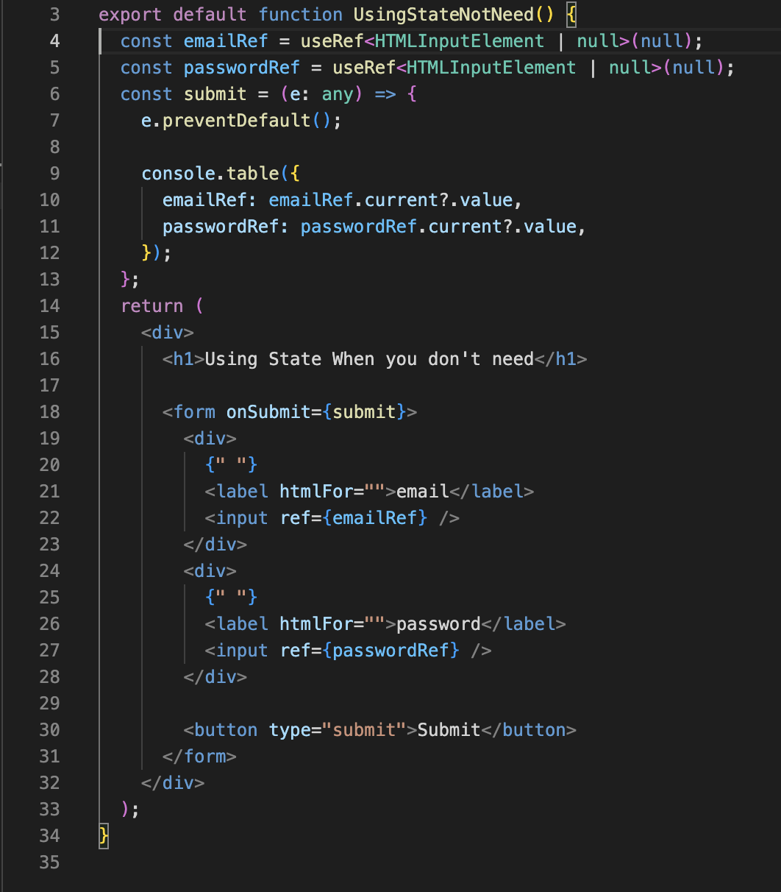
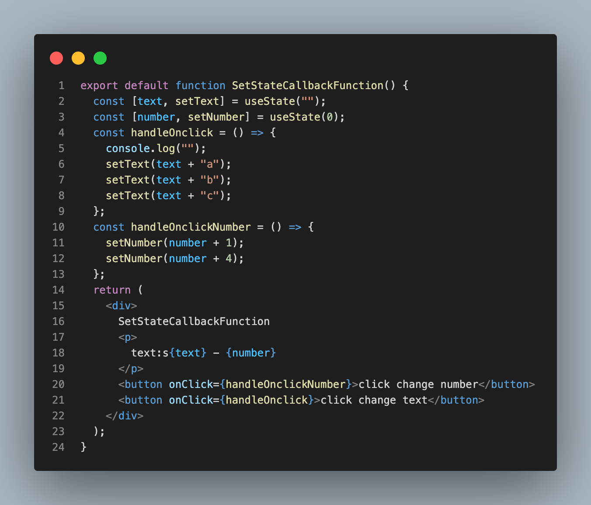
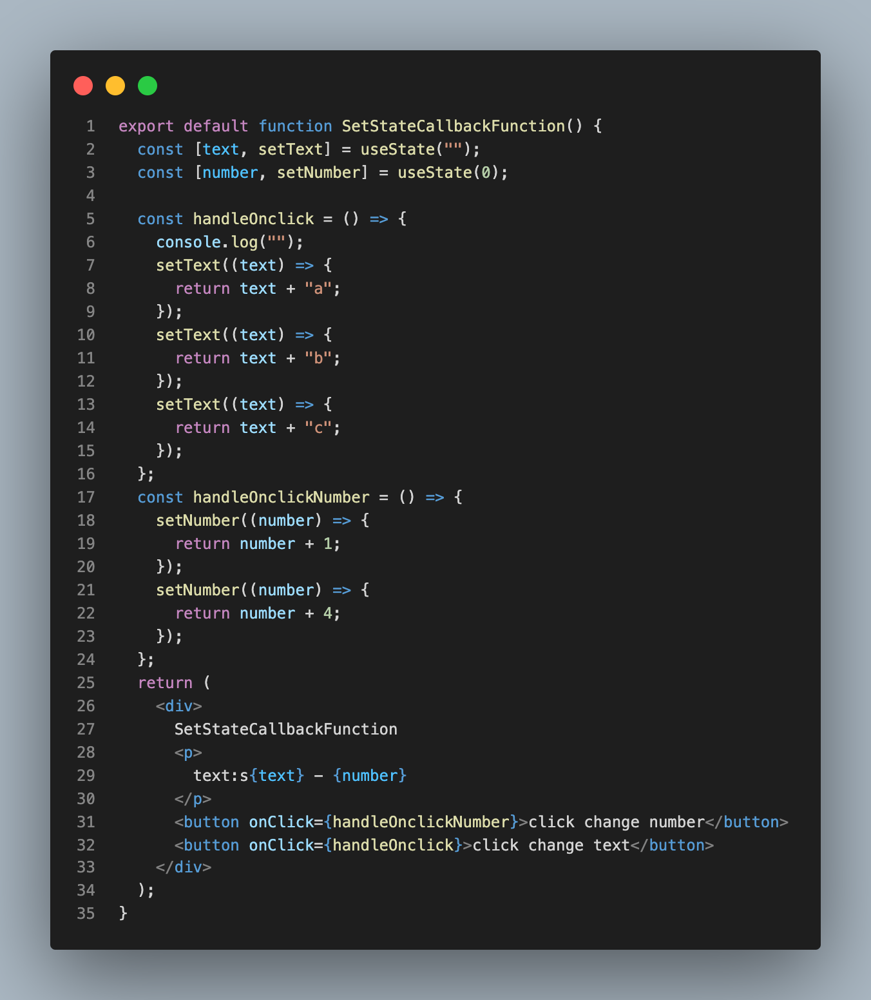

# 1. React Mistakes

## 1.1. Beginner

1. Using State When you don't need.
      1.  Before 
        
      2.  After
        
2. SetState Callback Function
      1. Before
        
      2. After
        
         

