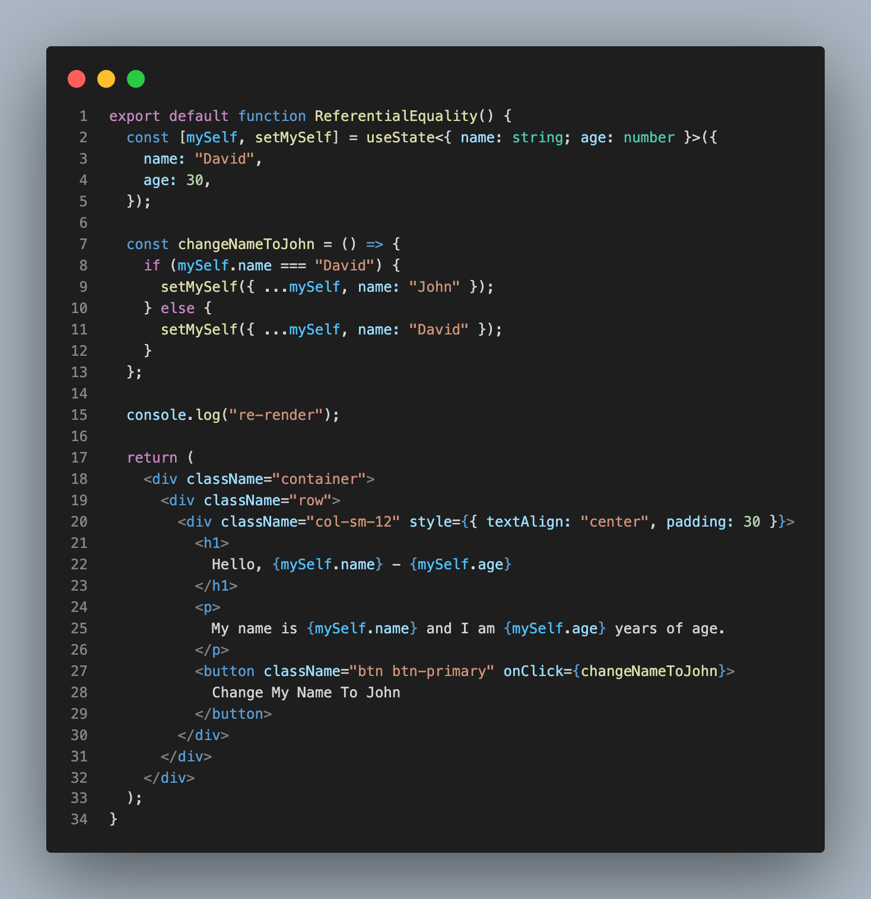

# 1. React Mistakes

## 1.1. Beginner

1. Using State When you don't need.
      1.  Before 
        
      2.  After
        
2. SetState Callback Function
      1. Before
        
      2. After
        
3. Referential Equality 
      1. Before 
        
      2. After
        
4. Using Memo, UseCallback, UseMemo
      1. Parent 
        
      2. Child
        
         

